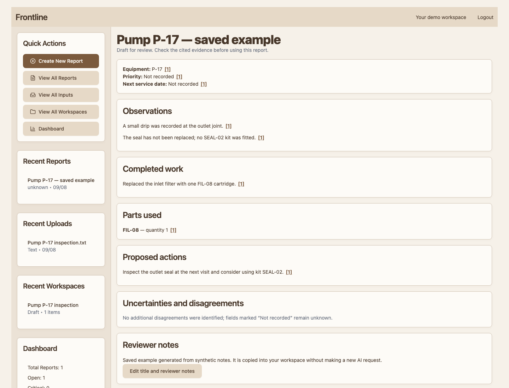

# Frontline

Maintenance reports with sources a reviewer can check.

Frontline turns written notes, recordings, and images into a draft maintenance report. It retrieves applicable manufacturer guidance, separates observations from completed work and proposals, and saves the sources behind each report.

**[Try the public demo](https://davidrussell.alwaysdata.net)** · [Report contract](docs/report-contract.md) · [Evaluation method](docs/evaluation-method.md) · [Hosting and operating guide](docs/hosting.md)



## The engineering problem

A proposed replacement can become an invented repair in a fluent summary. An unrecorded quantity can become a confident number. A valid source ID can point to a passage that does not support the claim.

The report contract makes those distinctions explicit. Pydantic and additional checks enforce structure, consistent evidence states, valid source IDs, and literal identifiers. The source snapshot stays unchanged when someone edits the workspace later. Reviewer notes are separate from generated findings.

These controls do not prove that every sentence is faithful. Semantic quality is reviewed separately; the initial review was delegated to the assistant and its limitations are recorded.

## What works now

- Separate visitor workspaces with a saved synthetic example and 24-hour expiry.
- Text, audio, and image inputs; Groq Whisper transcription and Qwen image descriptions.
- Background report generation with source citations, explicit unknown values, and visible disagreements.
- Indexed manufacturer references, filtered by model/revision and access, with guidance displayed separately from recorded work.
- Persistent quotas and cooldowns, bounded uploads, ownership checks, and restart recovery.
- A reproducible report-component pilot and a local interface for reviewing sources and outputs side by side.

The initial RAG library contains nine manufacturer-reference summaries covering Raspberry Pi 3 Model B+, 4, and 5. After entering the demo, choose **Try an example with manufacturer references**, then generate the gateway report. Unsupported or competing model information leaves the report grounded in the supplied notes. [Retrieval design and comparison](docs/reference-retrieval.md).

## Evidence and limits

The deployment check generated a report, transcribed a synthetic recording, and read a synthetic equipment label through the public URL. A controlled idle-cycle test confirmed that the process stopped, then woke in 1.19 seconds with its session, report, and upload intact. These are individual observations, not service-level guarantees. [Validation conditions](docs/hosting.md).

The original five development cases all passed the hosted structural checks. One still proposed an inspection beyond the recorded action, demonstrating why structural acceptance is insufficient. The expanded pilot has **20 synthetic input cases and 40 recorded paired traces**. At the owner's request, the assistant reviewed every output: **21 Pass / 19 Fail**, including four failures limited to completed-work section consistency. These judgments and initial field references are AI-authored and provisional; no human validation, held-out accuracy, or customer impact is claimed. [Full assistant assessment](evals/assessments/20260908T160338Z-pilot-assistant/report.md) · [Corpus and provenance](evals/corpus/README.md) · [Recorded pilot and objective results](evals/published/20260908T160338Z-pilot/objective-report.md).

The resulting instruction changes improved the assistant-reviewed outcome from **12/20 to 18/20** on those same development cases. All 20 new outputs passed structural validation and the four field checks. Two remaining interpretation/section errors are documented, including a new over-specific inspection claim. [Follow-up review and comparison limits](evals/assessments/20260908T220823Z-pilot-assistant/report.md).

The separate retrieval study compares keyword overlap, BM25, and an applicability ablation on 20 development cases. The revised BM25 system returned a relevant top result in 12/12 answerable cases and abstained in 8/8 unsupported cases; precision at two passages was 0.708, exposing unnecessary extra context. Four retrieval-plus-generation examples also received explicit assistant reviews. [Retrieval study](docs/reference-retrieval.md) · [RAG traces and reviews](evals/published/20260908T223019Z-rag/assistant-review.json).

The evaluation workflow draws on Hamel Husain and Shreya Shankar: inspect traces, derive failure categories from critiques, build application-specific checks, and validate any model judge against human labels. The initial review was delegated to the assistant; that substitution is disclosed, and human alignment remains unestablished. Criteria and review revisions are preserved. [Method and primary references](docs/evaluation-method.md).

## Run locally

Use Python 3.11 or later and install the application dependencies:

```sh
python -m pip install -r requirements.txt
```

Set `GROQ_API_KEY` in your environment for live inference. Start a local demo with a separate runtime directory:

```sh
FRONTLINE_DEMO=1 FRONTLINE_HTTPS_ONLY=0 FRONTLINE_DATA_DIR=/tmp/frontline-local-demo \
  python -m uvicorn main:app --host 127.0.0.1 --port 5001
```

Open `http://127.0.0.1:5001`. The saved example can be explored without making a model request. `.env.hosting.local` is a private deployment-credential file and is not automatically loaded by the application.

The public deployment uses alwaysdata Free, a lightweight Python environment, and Groq Free. Some AI requests wait for shared capacity; uploads and report attempts are limited. See the [operating guide](docs/hosting.md) for exact limits, storage paths, deployment, and rollback.

Legacy local registration/login and optional Moondream bounding-box detection remain available separately; install `requirements-vision.txt` only for that legacy feature. Public image descriptions are not represented as bounding-box detection.

## Run checks and review traces

The deterministic suite makes no live model requests:

```sh
python -m unittest discover -s tests -p 'test_*.py'
python -m evals.corpus_tools
python -m evals.pilot --prepare
python -m evals.check_retrieval --output /tmp/frontline-retrieval-check
```

The paired pilot uses the same model, source packet, schema, validation, and decoding settings for both variants; only the system instruction differs. A real run consumes Groq quota and deliberately spaces requests:

```sh
python -m evals.pilot --credentials .env.hosting.local
python -m evals.review_app --run evals/runs/RUN_DIRECTORY
```

Open the local address printed by the review command. Enter your name, mark Pass or Fail, and add a brief critique. Begin with 30 personal reviews before using assistant suggestions. Reviews save locally with append-only history and can be exported. No automatic label is presented as a human judgment.

`evals.scoring` reports structural outcomes and objective field comparisons, with known and unknown cases separated. Human semantic results require a selected reviewer and criteria version. The prepared GitHub Actions workflow runs only the deterministic checks and offline request preparation.

To inspect the completed assistant review without making model calls:

```sh
python -m evals.render_assessment --run evals/published/20260908T160338Z-pilot \
  --assessment evals/assessments/20260908T160338Z-pilot-assistant
python -m evals.review_app --run evals/published/20260908T160338Z-pilot \
  --assessment evals/assessments/20260908T160338Z-pilot-assistant
```

Open `http://127.0.0.1:5003/assessment`. The assessment is read-only and separate from the optional human-review journal.

## Project layout

| Location | Responsibility |
|---|---|
| `main.py`, `models.py`, `static/app.js` | FastHTML/HTMX interface, data records, and interaction |
| `reporting.py`, `report-instructions.txt` | Report contract and validation |
| `groq_service.py`, `report_workflow.py` | Provider calls, frozen source snapshots, and background jobs |
| `hosting_runtime.py`, `deploy/` | Storage boundaries, quotas, and deployment |
| `evals/corpus/`, `evals/pilot.py` | Versioned inputs and paired request capture |
| `evals/review_app.py`, `evals/scoring.py` | Human review and objective evaluation |
| `evals/assessments/`, `evals/render_assessment.py` | Attributed assistant judgments, source evidence, and reproducible review reports |
| `retrieval.py`, `reference-data/` | Versioned manufacturer passages, applicability filters, and ranked retrieval |

The interface uses HTMX 4, FastHTML, and MonsterUI with a beige and brown theme. [Version and migration notes](docs/ui-migration.md).

Remaining work includes broader source families, the two recorded report errors, more selective context, and operational quality monitoring.
